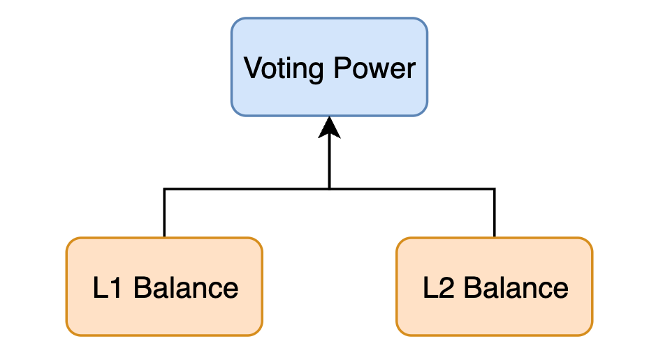
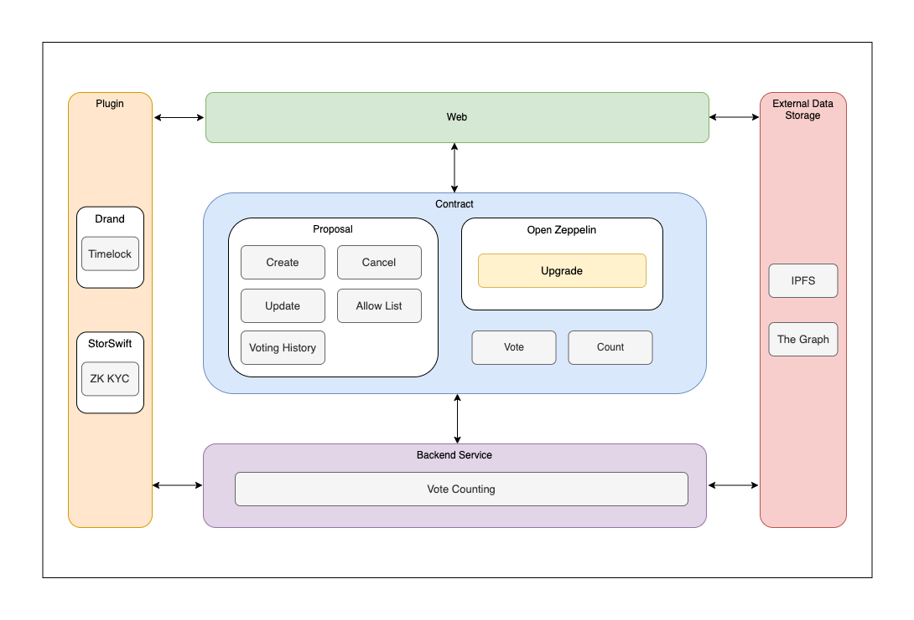
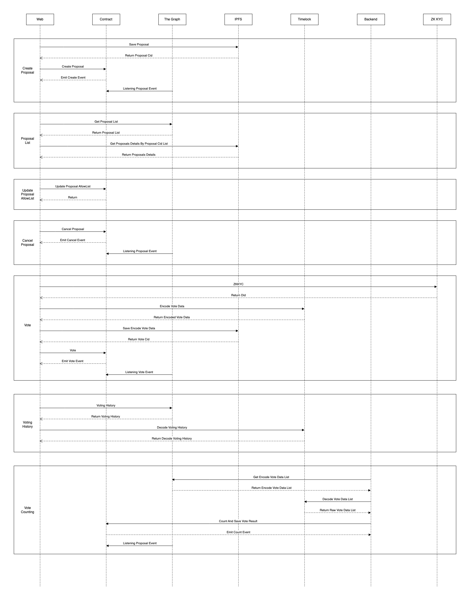
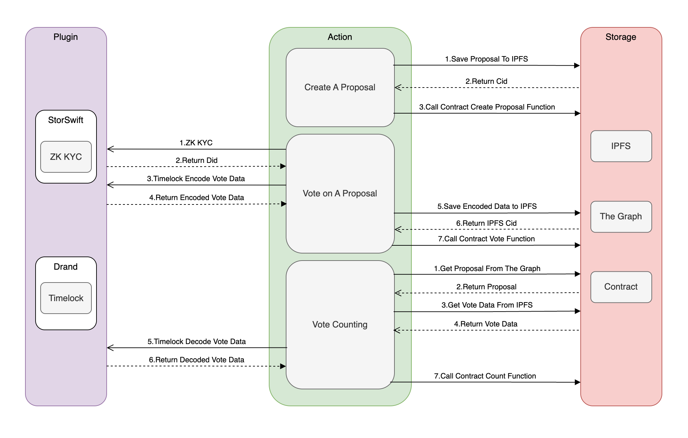

# StorSwift Power Voting

## 1. Overview

Power Voting dApp utilizes Drand Timelock, StorSwift ZK-KYC and Subgraphs technologies to achieve fair and private voting. Before the voting deadline, no one’s voting results will be seen by others, and the voting process will not be disturbed by other participant’s voting results. After the voting deadline, anyone can count the votes in a decentralized manner, and the results of the counting will executed and stored by smart contract and will not be manipulated by any centralized organization or individual. 

Power Voting dApp aims to become the infrastructure of DAO governance.

## 2. Problem

In the community voting process governed by DAO, since the voting data of other community members can be seen before the vote counting time, the community members will be affected by the existing voting data before voting, and some members will even take advantage of a large number of voting rights in their hands to vote at the end of the voting process to make the voting results are reversed, resulting in unfair voting.

In the centralized voting process, since the vote counting power is in the hands of the centralized organization, it will cause problems such as vote fraud and black box operation of vote counting, resulting in the voting results being manipulated by others, which cannot truly reflect the wishes of the community.

## 3. Solution

Power Voting dApp stores voting information on the blockchain, and all voting operations are executed on the chain, which is open and transparent. 

When community members vote, they use the timelock technology to lock the voting content, and voting content cannot be viewed until the voting expiration time reaches, so that no one can know the voting information of other members before voting expiration time reaches. 

After the counting time arrives, any voting participant can initiate a vote count without being affected by any centralized organization.

## 4. ZK-KYC

Power Voting dApp integrates with StorSwift ZK-KYC to protect user's privacy. Before user creating a proposal or voting on a proposal, user needs to login to StorSwift ZK-KYC platform to generate a UCAN specified DID with user roles and voting power properties, then ZK-KYC platform will interact with Power Voting dApp on-chain automatically to save user DID into Power Voting dApp allow-list. Only the users that have DID listed in Power Voting dApp allow-list can create a proposal or vote on a proposal.

## 5. Timelock

When creating a proposal, the creator will enter a voting expiration time, and Power Voting dApp will store the proposal content and voting expiration time together on the blockchain. When user votes on a proposal, Power Voting dApp will call Drand Timelock API to encrypt user's voting data and store the encrypt data into contract, the encrypt data won't be decrypt until the proposal expiration time. When proposal expiration time reached, Power Voting dApp will call Drand Timelock API to decrypt user's voting data to count the proposal. Power Voting dApp will lock all users' voting content and not allow anyone to query voting content until voting expiration time, to make sure no one can know the voting information of other members before voting expiration time reaches.

## 6. Voting Power Snapshot

When creating a proposal, Power Voting dApp will get the current `block.height` and store it together with proposal content on the blockchain. When a user votes, Power Voting dApp will obtain the balance of the user's `address` corresponding to the `block.height` when the proposal was created at, and then use the asset amount as the voting power to vote.

### zkSync ###

When on zkSync, contract is deployed on L2, Power Voting dApp will obtain both L1 and L2 balances of the user's `address` to calculate voting power.

## 7. Architecture Diagram

## 8. Timing Diagram

## 9. Proposal State Flow

## 10. Proposal Type

Power Voting dApp supports Single Answer and Multiple Answers proposals and can customize at most 10 options.
